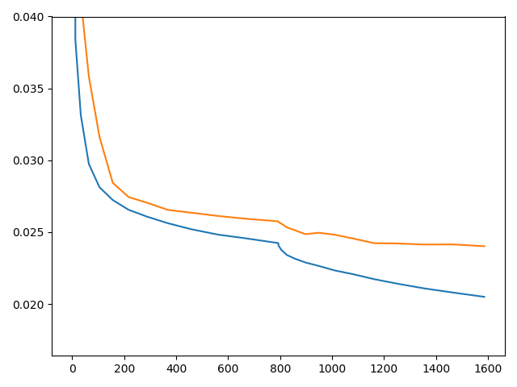

# Chess AI

_Sep 20 - 19_

I am going to treat this README as a journal for now too keep track of where I am and what I have to do.

The first step is to get a chess engine so we can play chess!
I Decided to go with [Sunfish](https://github.com/thomasahle/sunfish) (literally the first one I found).

~~My idea for now is to use off-policy q-learning and see where it takes me.
That requires a behacvioural policy that we can observe.
For that I will just use the in-built policy to begin with.
This means I'm going to have the game play itself.~~\
~~I've modified the code so that the MTD-bi search algorithm now plays against itself.
However, the issue is now that it gets stuck in loops.~~

I've found that there are more games online that I could ever need! I downladed 2.2 million games from https://www.kingbase-chess.net/. They are of the PGN format, which is not the same as what my chess engine takes. So I'm using python-chess to convert the moves to the correct format. I can convert around 250-290 games per second. This is much more than I could simulate per second if the games have to be of decent quality! I've converted 10,000 games and dumped them [here](./game_data/KingBase2019-A00-A39_10000_games.dump).

_Oct 19 - 19_

I'm thinking about just sticking with the `python-chess` module instead of using [Sunfish](https://github.com/thomasahle/sunfish), as I won't be simulating a lot of games myself if I'm just going to learn from the games I've already downloaded. I might change my mind again later.\
For now the task is to somehow convert the PGN format into something my neural net can use to learn from. So I need to decide on how to represent the state of the game.

**How I could represent the state**\
As there are 6 types of pieces of each color I have 12 types in total. There are 8x8 fields of a chess board. I could display this with a one-hot encoding with dimensions (12, 8, 8).

**How I could represent the action space**\
One way would be to just have the net choose two sets of coordinates. The original position of the piece and the position it ends up in. I could take this ouput and run it through `python-chess` as it has a function that returns legal moves. I don't know if this would lead to a lot of wasted compute though, as there are many moves that would then not be possible. This would also make it a classification task where there is only a single output. It might be better to have an output that consists of a probability space over the legal moves. But how can I have the legal moves change dynamically from round to round?
Maybe I could have the `python-chess` return all the legal moves, and then I could estimate the value of each of the new states, given the experience of the model. This sounds like it might be a better option...\
I think DeepMind's AlphaGo has two nets. One to estimate the policy and one to estimate the value. I could do the same. For the policy net the input could be the current state and the output the state after the move. I wonder if this would work, as the state-space complexity for chess is 10¹²⁰. But it still "only" corresponds to one-hot classifying a (12, 8, 8) shape matrix = 768. I think that's where I'll start.

#####Next steps:
1. Reformat the PGN format to shape (12, 8, 8) arrays input and output for both white and black
2. Think about what the value net would look like

_Oct 20 - 19_

I managed to make some relatively fast code that can extract input arrays from the Board object of `python-chess`. It also converts the black moves into white moves. 

I've looked a bit at AlphaGo, which is the one that uses two nets. It's not completely clear to me exactly what features they feed into the policy learning algorithm. But maybe I should just try coming up with my own method.

I've had the idea of first training a network to learn the legal moves of any given board position. I can then extract the embeddings from its hidden layer and use that to embed the board before I input it into the policy network. This is heavily inspired by Word2Vec [[1]](https://papers.nips.cc/paper/5021-distributed-representations-of-words-and-phrases-and-their-compositionality.pdf) [[2]](https://arxiv.org/abs/1301.3781).\
I will compare the effect of this embedding to just inputting the plain state array to the policy network.

I would really like for my policy network to output a probability over the moves. But how do I achieve that? I can make it a classification task where the output is a 589056 long one-hot vector (permutations of size 2 from 12 * 8 * 8 fields). Then I would get probabilities. I can't really figure out if that is better than getting an output array with shape (12, 8, 8). Because this would only output a single move. And what if that move is not legal? I think I'll just have to try.

##### Next steps:
_Updated Nov 10 - 19_
1. ~~Get input arrays for legal moves network from a subset of games~~
2. ~~Get corresponding output as one-hot vector of legal moves~~
3. Train a network to predict legal moves.
4. Extract embeddings from legal moves network
5. Think about what the value net would look like

##### Useful links
A fen viewer. To quickly visualize board from fen string
http://www.chess-poster.com/english/fen/fen_epd_viewer.htm

PGN viewer to see how a game is played (remember that board is turned and NOT mirrored for black turn as in my code)
https://chesstempo.com/pgn-viewer.html

_Nov 15 - 19_\
First results in! After fiddling around with creating my own network architecture that I couldn't really get to work, I decided to use resnet18, since this is a proven-to-work architecture (at least for images). I simply copied it from Pytorch github and adapted it to my input and output. Furthermore, I realized that I was using CrossEntropyLoss, which apparently applies softmax on it's own, meaning that'd I'd been putting my outputs through softmax twice.\
Still the results didn't really look that promising. This was until I converted the problem into a multilabel one and things started going better!\
\
Here the loss is shown for 16102 tranining samples and 923 validation samples. This is still only a tiny fraction of the games available, and it has only been trained for 10ish minutes on my own laptop CPU. In terms of accuracy I got correct train=0.247 correct test=0.174, which is the fraction of data points where the top 10 predictions are all legal moves. I think this looks very promising, especially taking into account the vast amount of illegal moves, how little data I've used so far (about 200 of my 2.2 million games) and that I've only trained for 10 minutes on an older laptop CPU. Stay tuned for more!
